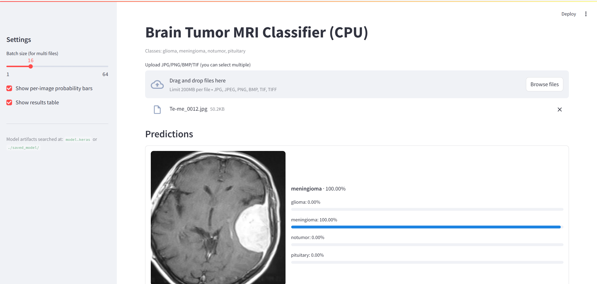

# Brain Tumor MRI — EfficientNetB0 (CPU Inference + Streamlit)

This repo contains a compact 4-class MRI classifier trained in Colab and packaged for **local CPU inference** in VS Code.

**Classes:** `glioma`, `meningioma`, `notumor`, `pituitary`  
**Backbone:** EfficientNetB0 @ **256×256 RGB** (ImageNet init)  
**Artifacts:** `model.keras` (preferred), `saved_model/` (fallback), `meta.json`  
**Apps:** `infer.py` (CLI) and `app_streamlit.py` (Streamlit UI)  
**Test accuracy (held-out):** ~**0.978**

> Research/education only — not a medical device.

---

## 1) What was done (concise summary)

- **Data ingestion & sanity checks**
  - Verified class folders: `Training/` and `Testing/` with 4 classes each.
  - Counted images per split/class and visualized quick montages.

- **EDA (image stats)**
  - Modes: mostly RGB with many grayscale images stored in RGB triplets.
  - **“Fake-RGB” rate ≈ 0.98** (3 channels virtually identical).
  - Common sizes around 512×512; standardized to **256×256** for training/inference.
  - Luminance histograms by class (sampled) showed subtle distribution shifts.
  - **Corruption check:** none found.

- **Near-duplicate & leakage cleanup**
  - Average-hash scan revealed cross-split duplicates.
  - **Overlap hashes: 509**; **moved 946 images** out of `Testing` to a quarantine directory to prevent leakage.

- **Datasets (tf.data)**
  - `image_dataset_from_directory` with `validation_split=0.2`, `BATCH_SIZE=32`, `IMG_SIZE=(256,256)`.
  - Class weights computed from training distribution.
  - Prefetch/cache enabled.

- **Model**
  - EfficientNetB0 backbone (ImageNet, top removed).
  - Head: GAP → Dropout(0.25) → Dense(4, softmax).
  - Preprocessing (`efficientnet.preprocess_input`) **embedded inside the graph** (so inference feeds raw RGB 0..255).

- **Training schedule**
  - Phase 1 (frozen): Adam(1e-3), 20 epochs, callbacks: EarlyStopping(patience=4, restore_best), ReduceLROnPlateau(factor=0.3).
  - Phase 2 (fine-tune top ~30%): Adam(1e-4), 10 epochs, same callbacks.
  - Validation accuracy improved from ~0.88–0.90 to **~0.97+** during fine-tuning.

- **Evaluation**
  - Test accuracy printed around **0.978** after de-duplication.
  - Confusion matrix and misclassified examples inspected.

- **Exported artifacts (Colab)**
  - `model.keras` (Keras v3 format, preferred for portability).
  - `saved_model/` (for Serving or Keras-3 inference via `TFSMLayer`).
  - `meta.json` storing `img_size` and `classes`.

- **Local inference (CPU, VS Code)**
  - CLI (`infer.py`): single image or folder → CSV, RGB conversion + resize to 256×256.
  - Streamlit (`app_streamlit.py`): drag-drop UI, per-class probability bars, CSV table download.
  - Robust loader: **tries `.keras` first**, falls back to **SavedModel via `keras.layers.TFSMLayer`** (required in Keras 3).

---

## 2) Repository layout

```
brain-tumour-mri/
├─ infer.py                  # CPU CLI (tries model.keras; falls back to SavedModel)
├─ app_streamlit.py          # Streamlit UI (CPU)
├─ model_runtime.py          # Shared CPU-only loader (keras first, TFSMLayer fallback)
├─ model.keras               # Keras v3 model (preferred)
├─ saved_model/              # Optional TF SavedModel (fallback path)
│  ├─ saved_model.pb
│  ├─ fingerprint.pb
│  ├─ assets/
│  └─ variables/
├─ meta.json                 # {"img_size":[256,256], "classes":[...]}
├─ requirements.txt
└─ data/
   └─ demo_images/           # optional sample images
```

> If `saved_model/` is nested under `brain_tumor_infer/saved_model/`, the loader also detects it.  
> If you only keep `model.keras`, that’s fine.

---

## 3) Environment (CPU, VS Code)

```bash
python -m venv .venv
# Windows
.venv\Scripts\activate
# macOS/Linux
source .venv/bin/activate

pip install --upgrade pip
pip install -r requirements.txt
```

Check TF (CPU only expected):
```bash
python -c "import tensorflow as tf; print('TF', tf.__version__)"
```

---

## 4) CLI usage (CPU)

**Single image**
```bash
python infer.py --image "data/demo_images/Te-gl_0010.jpg"
```

**Folder → CSV**
```bash
python infer.py --folder "data/demo_images" --out "runs/predictions.csv" --batch 32
```

CSV columns:
- `file`, `pred`, `conf`, and one column per class: `p_glioma`, `p_meningioma`, `p_notumor`, `p_pituitary`.

The CLI always converts images to **RGB** and resizes to **256×256**, then feeds float32 0..255 (preprocess is already inside the graph).

---

## 5) Streamlit app (CPU)

```bash
streamlit run app_streamlit.py
```

- Drag & drop multiple JPG/PNG/BMP/TIF.
- See top-1 and per-class probability bars per image.
- Results table with a CSV download button.
- Uses the same loader logic: `.keras` first, then `TFSMLayer` on `saved_model/`.



---

## 6) Troubleshooting

- **Input channels mismatch (`… got (… 1)`)**  
  You passed a single-channel tensor into EfficientNet. The provided code always does `convert("RGB")` → OK. Make sure you’re running this code without extra preprocessing.

- **Keras 3 “File format not supported: SavedModel”**  
  In Keras 3, `load_model()` doesn’t load SavedModel directly. The provided loader uses:  
  `keras.layers.TFSMLayer("saved_model", call_endpoint="serve" or "serving_default")` as a **fallback**. No change needed.

- **Nested `saved_model/saved_model`**  
  If your zip produced `saved_model/saved_model/...`, move the inner contents up so `saved_model.pb` is directly under `saved_model/`. The loader also checks a nested `brain_tumor_infer/saved_model/` path.

- **oneDNN / tf.placeholder warnings**  
  Cosmetic on CPU. You can silence via environment variables at the top of the files if desired.

---

## 7) Files (copy these verbatim)

### `requirements.txt`
```text
tensorflow==2.20.0
keras>=3.3.0,<3.7

numpy==1.26.4
pandas==2.2.2
pillow==10.4.0
streamlit==1.37.0

h5py>=3.10.0
protobuf>=3.20.3,<5.0.0
```

> If disk is tight, you can swap `tensorflow==2.20.0` for `tensorflow-cpu==2.20.0`.

### `model_runtime.py`
```python
import os
os.environ["CUDA_VISIBLE_DEVICES"] = "-1"
os.environ["TF_CPP_MIN_LOG_LEVEL"] = "2"
# os.environ["TF_ENABLE_ONEDNN_OPTS"] = "0"  # optional

from pathlib import Path
import json
import numpy as np
from PIL import Image, ImageOps
import tensorflow as tf

HERE = Path(__file__).resolve().parent
KERAS_PATH     = HERE / "model.keras"
META_PATH      = HERE / "meta.json"
SAVED_DIR_ROOT = HERE / "saved_model"
SAVED_DIR_SUB  = HERE / "brain_tumor_infer" / "saved_model"  # if your folder is nested

if not META_PATH.exists():
    raise FileNotFoundError(f"Missing meta.json next to app: {META_PATH}")
META = json.loads(META_PATH.read_text(encoding="utf-8"))
IMG_SIZE    = tuple(META["img_size"])
CLASS_NAMES = list(META["classes"])

def _load_model_any():
    if KERAS_PATH.exists():
        try:
            m = tf.keras.models.load_model(KERAS_PATH, compile=False)
            print(f"[runtime] Loaded .keras: {KERAS_PATH.name}")
            return m, False
        except Exception as e:
            print("[runtime] .keras failed; will try SavedModel via TFSMLayer:", e)

    from keras.layers import TFSMLayer
    sm = None
    if (SAVED_DIR_ROOT / "saved_model.pb").exists():
        sm = SAVED_DIR_ROOT
    elif (SAVED_DIR_SUB / "saved_model.pb").exists():
        sm = SAVED_DIR_SUB
    else:
        raise FileNotFoundError(
            "No model found. Place model.keras or a SavedModel folder at ./saved_model/ (contains saved_model.pb)."
        )
    layer = None
    for endpoint in ("serve", "serving_default"):
        try:
            layer = TFSMLayer(str(sm), call_endpoint=endpoint)
            break
        except Exception:
            pass
    if layer is None:
        raise RuntimeError(f"Could not open SavedModel at {sm}")

    inp = tf.keras.Input(shape=(*IMG_SIZE, 3), dtype=tf.float32, name="input")
    out = layer(inp)
    if isinstance(out, dict):
        out = list(out.values())[0]
    m = tf.keras.Model(inp, out, name="brain_tumor_infer_tfsml")
    print(f"[runtime] Loaded SavedModel via TFSMLayer: {sm}")
    return m, True

MODEL, FROM_SAVEDMODEL = _load_model_any()

def preprocess_pil(pil_img: Image.Image) -> np.ndarray:
    im  = ImageOps.exif_transpose(pil_img).convert("RGB").resize(IMG_SIZE)
    arr = np.asarray(im, dtype=np.float32)  # 0..255
    return np.expand_dims(arr, axis=0)

def predict_pil(pil_img: Image.Image):
    x = preprocess_pil(pil_img)
    probs = MODEL.predict(x, verbose=0)[0]
    idx = int(np.argmax(probs))
    return CLASS_NAMES[idx], float(probs[idx]), {c: float(p) for c, p in zip(CLASS_NAMES, probs)}
```

### `infer.py`
```python
#!/usr/bin/env python
import os
os.environ["CUDA_VISIBLE_DEVICES"] = "-1"
os.environ["TF_CPP_MIN_LOG_LEVEL"] = "2"

import json, argparse, csv
from pathlib import Path
import numpy as np
from PIL import Image, ImageOps, UnidentifiedImageError
import tensorflow as tf

HERE = Path(__file__).resolve().parent
KERAS_PATH      = HERE / "model.keras"
META_PATH       = HERE / "meta.json"
SAVED_DIR_ROOT  = HERE / "saved_model"
SAVED_DIR_SUB   = HERE / "brain_tumor_infer" / "saved_model"

if not META_PATH.exists():
    raise FileNotFoundError(f"Missing meta.json next to infer.py: {META_PATH}")
META = json.loads(META_PATH.read_text(encoding="utf-8"))
IMG_SIZE    = tuple(META["img_size"])
CLASS_NAMES = list(META["classes"])

def load_model_any():
    print("TensorFlow:", tf.__version__)
    if KERAS_PATH.exists():
        try:
            m = tf.keras.models.load_model(KERAS_PATH, compile=False)
            print(f"Loaded .keras: {KERAS_PATH.name}")
            return m
        except Exception as e:
            print("Failed to load .keras; will use SavedModel via TFSMLayer.\nReason:", e)
    from keras.layers import TFSMLayer
    sm = None
    if (SAVED_DIR_ROOT / "saved_model.pb").exists():
        sm = SAVED_DIR_ROOT
    elif (SAVED_DIR_SUB / "saved_model.pb").exists():
        sm = SAVED_DIR_SUB
    else:
        raise FileNotFoundError(
            "No model available. Put model.keras next to infer.py or a saved_model/ folder here or under brain_tumor_infer/."
        )
    for endpoint in ("serve", "serving_default"):
        try:
            layer = TFSMLayer(str(sm), call_endpoint=endpoint)
            break
        except Exception:
            layer = None
    if layer is None:
        raise RuntimeError(f"Could not open SavedModel at {sm}")
    inp = tf.keras.Input(shape=(*IMG_SIZE, 3), dtype=tf.float32, name="input")
    out = layer(inp)
    if isinstance(out, dict):
        out = list(out.values())[0]
    m = tf.keras.Model(inp, out, name="brain_tumor_infer_tfsml")
    print(f"Loaded SavedModel via TFSMLayer: {sm}")
    return m

MODEL = load_model_any()

def _prep_from_pil(pil_img: Image.Image):
    im  = ImageOps.exif_transpose(pil_img).convert("RGB").resize(IMG_SIZE)
    arr = np.asarray(im, dtype=np.float32)
    return np.expand_dims(arr, axis=0)

def predict_one(path: str) -> dict:
    with Image.open(path) as im:
        x = _prep_from_pil(im)
    probs = MODEL.predict(x, verbose=0)[0]
    idx = int(np.argmax(probs))
    return {
        "file": str(Path(path).resolve()),
        "pred": CLASS_NAMES[idx],
        "conf": float(probs[idx]),
        **{f"p_{c}": float(p) for c, p in zip(CLASS_NAMES, probs)},
    }

def run_image(path: str):
    r = predict_one(path)
    print(f"\nFile: {Path(path).name}")
    print(f"Top-1: {r['pred']} ({r['conf']:.2%})")
    for c in CLASS_NAMES:
        print(f"{c:>12}: {r[f'p_{c}']:.4f}")

def _iter_image_files(folder: str, recursive: bool = False):
    exts = {".jpg",".jpeg",".png",".bmp",".tif",".tiff"}
    pat = "**/*" if recursive else "*"
    for p in Path(folder).glob(pat):
        if p.is_file() and p.suffix.lower() in exts:
            yield str(p)

def run_folder(folder: str, out_csv: str, batch: int = 16, recursive: bool = False):
    files = list(_iter_image_files(folder, recursive))
    if not files:
        print("No images found in:", folder); return
    rows = []; i = 0
    while i < len(files):
        chunk = files[i:i+batch]
        imgs, keep = [], []
        for p in chunk:
            try:
                with Image.open(p) as im:
                    im = ImageOps.exif_transpose(im).convert("RGB").resize(IMG_SIZE)
                    imgs.append(np.asarray(im, dtype=np.float32))
                keep.append(p)
            except (UnidentifiedImageError, OSError):
                print(f"Skipping unreadable file: {p}")
        if imgs:
            x = np.stack(imgs, axis=0)
            probs = MODEL.predict(x, verbose=0)
            for pth, prob in zip(keep, probs):
                k = int(np.argmax(prob))
                rows.append({
                    "file": str(Path(pth).resolve()),
                    "pred": CLASS_NAMES[k],
                    "conf": float(prob[k]),
                    **{f"p_{c}": float(v) for c, v in zip(CLASS_NAMES, prob)},
                })
        i += batch
    if not rows:
        print("No valid images processed."); return
    out_path = Path(out_csv)
    if out_path.parent and not out_path.parent.exists():
        out_path.parent.mkdir(parents=True, exist_ok=True)
    with out_path.open("w", newline="") as f:
        w = csv.DictWriter(f, fieldnames=rows[0].keys()); w.writeheader(); w.writerows(rows)
    print(f"Saved {len(rows)} predictions → {out_path}")

def main():
    ap = argparse.ArgumentParser(description="Brain Tumor MRI inference (CPU).")
    m = ap.add_mutually_exclusive_group(required=True)
    m.add_argument("--image",  help="Path to a single image")
    m.add_argument("--folder", help="Path to a folder of images")
    ap.add_argument("--out", default="predictions.csv", help="CSV path for --folder")
    ap.add_argument("--batch", type=int, default=16, help="Batch size for --folder")
    ap.add_argument("--recursive", action="store_true", help="Recurse into subfolders for --folder")
    args = ap.parse_args()
    if args.image:
        run_image(args.image)
    else:
        run_folder(args.folder, args.out, batch=args.batch, recursive=args.recursive)

if __name__ == "__main__":
    main()
```

### `app_streamlit.py`
```python
import os
os.environ["CUDA_VISIBLE_DEVICES"] = "-1"
os.environ["TF_CPP_MIN_LOG_LEVEL"] = "2"
# os.environ["TF_ENABLE_ONEDNN_OPTS"] = "0"  # optional

import streamlit as st
import pandas as pd
import numpy as np
from io import BytesIO
from PIL import Image, ImageOps, UnidentifiedImageError

import model_runtime as rt

st.set_page_config(page_title="Brain Tumor MRI (CPU)", layout="wide")
st.title("Brain Tumor MRI Classifier")
st.caption("Classes: " + ", ".join(rt.CLASS_NAMES))

with st.sidebar:
    st.header("Settings")
    batch_size = st.slider("Batch size (multi-file)", 1, 64, 16, 1)
    show_cards = st.checkbox("Show per-image cards", value=True)
    show_table = st.checkbox("Show results table", value=True)
    st.caption("Model: .keras preferred; SavedModel via TFSMLayer fallback")


def prep_bytes(data: bytes):
    img = Image.open(BytesIO(data))
    img = ImageOps.exif_transpose(img).convert("RGB").resize(rt.IMG_SIZE)
    arr = np.asarray(img, dtype=np.float32)
    return np.expand_dims(arr, axis=0), img

def predict_many(files, batch: int):
    arrays, keep_imgs, names = [], [], []
    for f in files:
        try:
            arr, pil = prep_bytes(f.read())
            arrays.append(arr[0])
            keep_imgs.append(pil)
            names.append(f.name)
        except (UnidentifiedImageError, OSError) as e:
            st.warning(f"Skipping unreadable file: {f.name} ({e})")
    if not arrays:
        return []
    rows = []
    for i in range(0, len(arrays), batch):
        chunk = np.stack(arrays[i:i+batch], axis=0)
        probs = rt.MODEL.predict(chunk, verbose=0)
        for name, pil_img, prob in zip(names[i:i+batch], keep_imgs[i:i+batch], probs):
            k = int(np.argmax(prob))
            rows.append({
                "file": name,
                "pred": rt.CLASS_NAMES[k],
                "conf": float(prob[k]),
                **{f"p_{c}": float(v) for c, v in zip(rt.CLASS_NAMES, prob)},
                "_pil": pil_img,
            })
    return rows

files = st.file_uploader("Upload JPG/PNG/BMP/TIF (multi-select ok)", type=["jpg","jpeg","png","bmp","tif","tiff"], accept_multiple_files=True)

if files:
    rows = predict_many(files, batch=batch_size)
    if not rows:
        st.stop()

    if show_cards:
        st.subheader("Predictions")
        for r in rows:
            with st.container(border=True):
                c1, c2 = st.columns([1, 2], vertical_alignment="center")
                with c1:
                    st.image(r["_pil"], caption=r["file"], use_container_width=True)
                with c2:
                    st.markdown(f"**{r['pred']}** · {r['conf']:.2%}")
                    for c in rt.CLASS_NAMES:
                        st.progress(min(1.0, r[f"p_{c}"]), text=f"{c}: {r[f'p_{c}']:.2%}")

    if show_table:
        st.subheader("Results table")
        df = pd.DataFrame([{k:v for k,v in r.items() if k != "_pil"} for r in rows])
        df = df.sort_values("conf", ascending=False).reset_index(drop=True)
        st.dataframe(df, use_container_width=True)
        csv = df.to_csv(index=False).encode("utf-8")
        st.download_button("Download CSV", csv, file_name="predictions.csv", mime="text/csv")
else:
    st.info("Upload one or more images to get predictions.")
```

---

## 8) Re-export (if you retrain)

In Colab:

```python
model.save("model.keras")          # Keras v3 (recommended)
model.export("saved_model")        # TF SavedModel (for Serving / TFSMLayer)
with open("meta.json","w") as f:
    json.dump({"img_size":[256,256], "classes": class_names, "has_preprocess_in_model":True}, f, indent=2)
```

Copy those artifacts into your repo root.

---

## 9) Notes & limitations

- Preprocessing is **inside the graph**. Don’t normalize twice; pass RGB float32 0..255.
- Inference assumes a single axial slice per file; clinical deployment would require study-level logic and broader validation.
- If `.keras` fails to deserialize on your local Keras build, the loader **automatically** switches to SavedModel via `TFSMLayer`.
